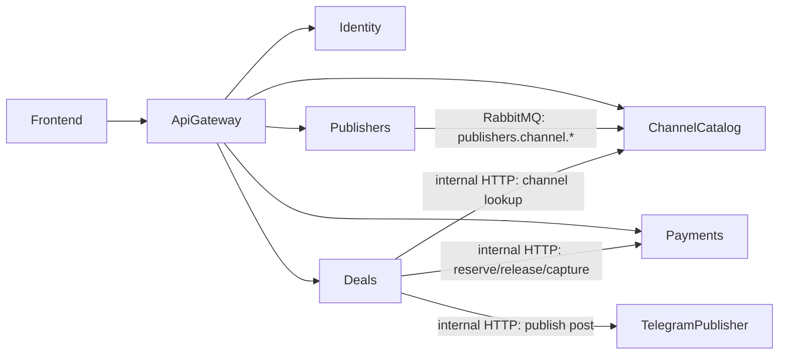

# Backend Source Architecture
## Общая картина

Проект построен как marketplace для Telegram-размещений. Runtime-сервисы разделены по бизнес логике и владеют своими данными.

Ключевые принципы:

- `database per service`: каждый активный .NET-сервис использует свою Postgres БД.
- Критичные проверки и денежные операции идут по HTTP, проекции и интеграционные события - через RabbitMQ.
- `ChannelCatalog` строится из событий `Publishers`.

## Сервисы

- `ApiGateway` - единая точка входа (Reverse Proxy на базе YARP) для маршрутизации внешних запросов к микросервисам.
- `Identity` - регистрация, логин, выпуск JWT, endpoint `me`.
- `Publishers` - мастер-данные каналов паблишеров и модерация.
- `ChannelCatalog` - read-model каталога каналов для поиска и internal lookup.
- `Deals` - orchestration сделок, автоматической публикации и dispute flow.
- `Payments` - кошельки, резервы, пополнения, YooKassa, ledger паблишеров.
- отдельного runtime-сервиса `Advertisers` сейчас нет; рекламодатель представлен ролью `Advertiser` в `Identity`.

Вне `backend/src` также есть `telegram-publisher` - Python/FastAPI adapter для Telegram Bot API. `Publishers` использует его для проверки прав бота в канале, а `Deals` - для публикации рекламного поста после принятия заявки или auto-mode создания сделки.

## BuildingBlocks

`BuildingBlocks` - это shared-библиотеки:

- `Marketplace.Contracts` - контракты событий.
- `Marketplace.Messaging` - RabbitMQ и outbox primitives.
- `Marketplace.Security` - JWT и role policies.
- `Marketplace.ServiceAuth` - `X-Service-Token` для internal API.
- `Marketplace.Observability` - logging, correlation id, rate limiting.
- `Marketplace.Kernel` - место под общие доменные примитивы.

## Слои сервисов

Большинство сервисов используют одинаковый набор проектов:

- `.Host` - ASP.NET entrypoint, DI, middleware, healthchecks, migrations.
- `.Presentation` - controllers, DTO, HTTP surface.
- `.UseCases` - commands, queries, handlers, бизнес-сценарии.
- `.Infrastructure` - EF Core, DbContext, migrations, RabbitMQ, HTTP clients, outbox/inbox.
- `.Entities` - доменные сущности, value objects, enum-статусы.
